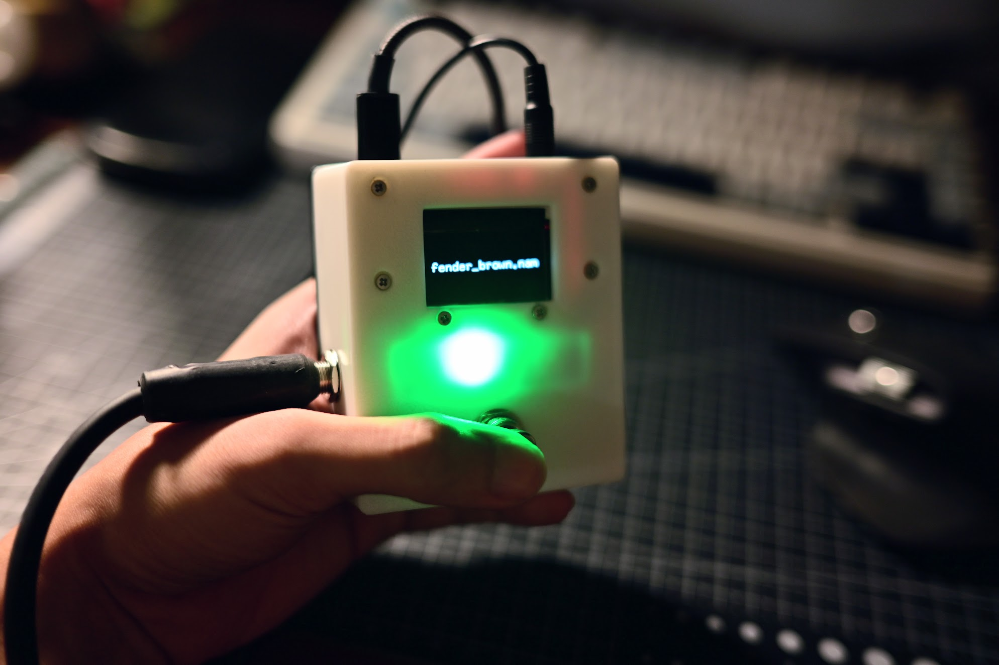
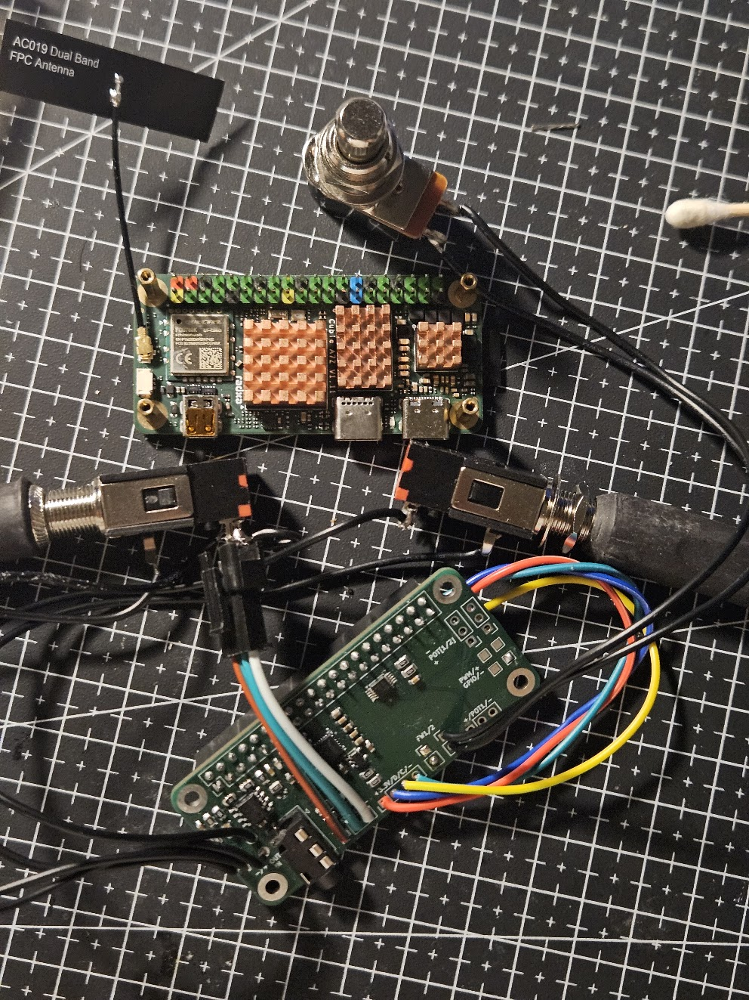

Budget neural amp modelling on a Radxa Cubie A7Z.

---



[(sloppy demo video)](https://www.youtube.com/shorts/qqARMGN2HPs)

The repository houses the hardware/firmware for a standalone neural amp modelling guitar pedal hosted on a Linux SBC. Written in Rust and FFIs into the [NAM A2 inference engine](https://github.com/sdatkinson/NeuralAmpModelerCore).

This repository contains:

- The firmware
  - The Rust firmware for the pedal, including the audio processing pipeline and the inference engine FFI.
- The hardware files
  - The schematics and PCB design files for the audio 'sound card' to condition instrument level signals and read/write audio to/from the SBC.
  - The Linux device tree overlay for this audio board.

**Please see this repository as more of a reference design for what's possible and how such a pedal could be built, rather than a polished product.**

## Hardware setup

1. Source a Radxa Cubie A7Z
   - Note: other similar SBCs (like the Pi Zero/OrangePis/etc.) likely **will not work** due to different GPIO header pinouts
2. Have the audio board fabricated with all components populated.
3. Connect the audio board to the SBC via the 40-pin GPIO header.
4. Connect other peripherals to the audio board. In my case, I connected (and built my firmware around):
   - 3.5mm headphone jack for phones
   - 6.35mm TS input for guitar
   - 6.35mm TS output for amp
   - A single footswitch
   - An I2C OLED display (SH1106)
   - A WS2812B LED strip



## Firmware

1. Flash the SBC with Linux. Official Radxa images or community Armbian images should work fine.
2. Compile and load the drivers for the audio board's underlying codec (TAC5112).
   - See the [TI git repository](https://git.ti.com/cgit/lpaa-android-drivers/tac5x1x-linux-driver/?h=tac5x1x_driver) for the source. Check into whichever branch/tag is compatible with your kernel version.
   - `make` then `insmod`/`modprobe` the kernel module.
3. Compile and load the device tree overlay for the audio board.
   - See the `./hardware/tac5112_i2c_i2s_overlay.dts` file for the device tree source. `dtc` to compile it into a `.dtbo` file, then load it via `rsetup`
4. Compile the firmware either on the SBC directly, or cross-compile it on a host machine.
   - Make sure to `git submodule update --init --recursive` to pull in all the dependencies before hand
5. *You may or may not need to run these commands to set up the codecs ADCs/DACs/recording/playback paths.*
   ```sh
   sudo amixer -c 0 cset name='ASI_RX_CH1_EN Switch' on
   sudo amixer -c 0 cset name='OUT1x Source' 'DAC Input'
   sudo amixer -c 0 cset name='OUT1x Config' 'Pseudo differential with OUTxM as VCOM'
   sudo amixer -c 0 cset name='OUT1x Driver' 'Headphone'

   sudo amixer -c 0 cset name='ASI_RX_CH2_EN Switch' on
   sudo amixer -c 0 cset name='OUT2x Source' 'DAC Input'
   sudo amixer -c 0 cset name='OUT2x Config' 'Mono Single-ended at OUTxP only'
   sudo amixer -c 0 cset name='OUT2x Driver' 'Line-out'

   sudo amixer -c 0 cset name='ADC1 Config' 'Single-ended'
   sudo amixer -c 0 cset name='ADC1 Common-mode Tolerance' 'AC Coupled with 100mVpp'
   sudo amixer -c 0 cset name='ADC1 Full-Scale' '2/10-VRMS'
   sudo amixer -c 0 cset name='ASI_TX_CH1 Slot' 'Slot0'
   sudo amixer -c 0 cset name='ASI_TX_CH1_EN Capture Switch' on
   sudo amixer -c 0 cset name='ADC1 Digital Capture Volume' 161

   sudo amixer -c 0 cset name='IN1 Source Mux' 'Analog'
   sudo amixer -c 0 cset name='IN2 Source Mux' 'Analog'
   ```
6. Compile and run the firmware (**in release mode!**). Pass in the directory filled with `.nam` files as an arguement. e.g
   ```bash
   > cargo build --release
   > ./target/release/antidote /path/to/nam/files
   # Or:
   > cargo run --release -- /path/to/nam/files
   ...
   2026-09-25T16:57:33.860341Z  INFO antidote: Starting Antidote.
   2026-09-25T16:57:33.880659Z  INFO antidote::modeller: Loaded NAM A2 model. model_path=resources/fender_brown.nam
   2026-09-25T16:57:33.880875Z  INFO antidote: Starting CPAL.
   2026-09-25T16:57:33.989547Z  INFO antidote: Playing back audio for 500 seconds.
   2026-09-25T16:57:34.898597Z  INFO antidote::audio: Audio errors input_drops=0 output_drops=0 output_underruns=320
   2026-09-25T16:57:35.898842Z  INFO antidote::audio: Audio errors input_drops=0 output_drops=0 output_underruns=320
   2026-09-25T16:57:36.899102Z  INFO antidote::audio: Audio errors input_drops=0 output_drops=0 output_underruns=320
   ...
   ...
   ```

## Polishing touches

Once everything is working, some things you can do to make the pedal more usable:

- Add a `systemd` service to run the firmware on boot

### Optimizations

- Disable all unnecessary kernel modules to reduce boot time
  - Stock boots in around ~20 seconds which is actually pretty good - but you can cut another 5-10
- If using a `6.12+` kernel, you can use the play with the `PREEMPT_RT` to reduce latency
- Play around with `mlockall` and `threadirqs`, core pinning/isolation. You can push buffer sizes to around ~24 this way yielding a theorical round-trip latency of ~2ms. 

## Some design goals/notes:

In principle, this project actually builds an entire hardware platform for *any* real-time guitar processing application for Linux SBCs. You can just as easily swap out the the firmware for another that runs say LV2/VST plugins. Though the main focus is on a standalone NAM pedal.


---

Built on top of:

- [NAM A2 Source Code](https://github.com/sdatkinson/NeuralAmpModelerCore)
- [NAM A2 Reference](https://www.tone3000.com/guides/nam-a2-the-complete-guide)
