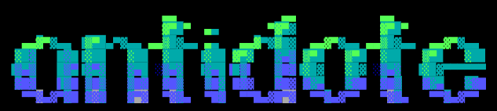

Budget neural amp modelling on a Radxa Cubie A7Z.

---

Very much WIP.

---

Built on the shoulders of giants:
- [NAM A2 Source Code](https://github.com/sdatkinson/NeuralAmpModelerCore)
- [NAM A2 Reference](https://www.tone3000.com/guides/nam-a2-the-complete-guide)
